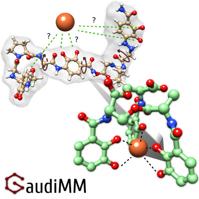

.. GaudiMM: Genetic Algorithms with Unrestricted
   Descriptors for Intuitive Molecular Modeling

   https://github.com/insilichem/gaudi

   Copyright 2017 Jaime Rodriguez-Guerra, Jean-Didier Marechal

   Licensed under the Apache License, Version 2.0 (the "License");
   you may not use this file except in compliance with the License.
   You may obtain a copy of the License at

        http://www.apache.org/licenses/LICENSE-2.0

   Unless required by applicable law or agreed to in writing, software
   distributed under the License is distributed on an "AS IS" BASIS,
   WITHOUT WARRANTIES OR CONDITIONS OF ANY KIND, either express or implied.
   See the License for the specific language governing permissions and
   limitations under the License.

GaudiMM
=======

.. image:: https://travis-ci.org/insilichem/gaudi.svg?branch=master
    :target: https://travis-ci.org/insilichem/gaudi

.. image:: https://readthedocs.org/projects/gaudi/badge/?version=latest
    :target: http://gaudi.readthedocs.io/en/latest/

.. image:: https://anaconda.org/insilichem/gaudi/badges/installer/conda.svg
    :target: https://conda.anaconda.org/insilichem/gaudi

.. image:: https://img.shields.io/badge/doi-10.1002%2Fjcc.24847-blue.svg
    :target: http://onlinelibrary.wiley.com/doi/10.1002/jcc.24847/full

GaudiMM, for Genetic Algorithms with Unrestricted Descriptors for Intuitive Molecular Modeling,
helps to sketch new molecular designs that require complex interactions.

Features
--------

**Full multi-objective optimization**

- Feel free to optimize H bonds, hydrophobic interactions, desolvation effects, distances between given sets of atoms, rotamers and more, without compromises.

**Unprecedented customizability**

- Every gene and objective is a separate module, so they can be called on demand one or more times. This flexible approach allows very different calculations with the same mindset: exploration and evaluation.

**Developer friendly**

- If the provided genes and objectives are not enough, you can always code your own ones. Check out the `developer docs <http://gaudi.readthedocs.io/en/latest/developers.html>`_!

Documentation and support
-------------------------

Documentation source is available in ``docs/`` subdirectory, and also compiled as HTML at `this webpage <http://gaudi.readthedocs.io/>`_.

If you need help with GaudiMM, please use the `issues page <https://github.com/insilichem/gaudi/issues>`_ of our `GitHub repo <https://github.com/insilichem/gaudi>`_. You can drop me a message at `jaime.rodriguezguerra@uab.cat <mailto:jaime.rodriguezguerra@uab.cat>`_ too.

License
-------

GaudiMM is licensed under the GNU Lesser General Public License version 3. Check the details in the `LICENSE <https://raw.githubusercontent.com/insilichem/gaudi/master/LICENSE>`_ file.

Citation
--------

GaudiMM is scientific software, funded by public research grants (Spanish MINECO's project ``CTQ2014-54071-P``, Generalitat de Catalunya's project ``2014SGR989`` and research grant ``2015FI_B00768``, COST Action ``CM1306``). If you make use of GaudiMM in scientific publications, please cite `our article in JCC <http://onlinelibrary.wiley.com/doi/10.1002/jcc.24847/full>`_. It will help measure the impact of our research and future funding!

.. code-block:: latex

    @article {JCC:JCC24847,
        author = {Rodríguez-Guerra Pedregal, Jaime and Sciortino, Giuseppe and Guasp, Jordi and Municoy, Martí and Maréchal, Jean-Didier},
        title = {GaudiMM: A modular multi-objective platform for molecular modeling},
        journal = {Journal of Computational Chemistry},
        volume = {38},
        number = {24},
        issn = {1096-987X},
        url = {http://dx.doi.org/10.1002/jcc.24847},
        doi = {10.1002/jcc.24847},
        pages = {2118--2126},
        keywords = {molecular modeling, protein-ligand docking, multi-objective optimization, genetic algorithms, metallopeptides},
        year = {2017},
    }
