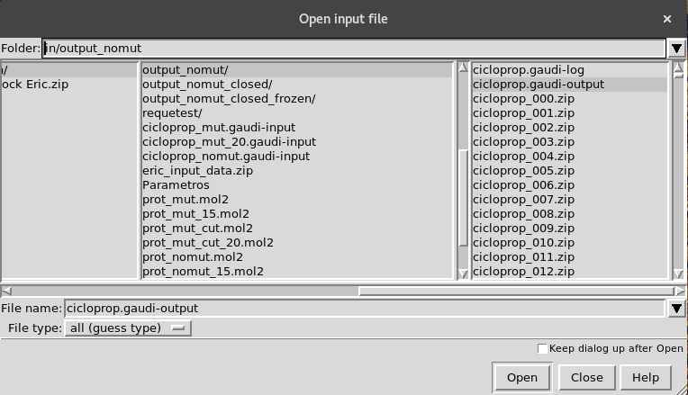
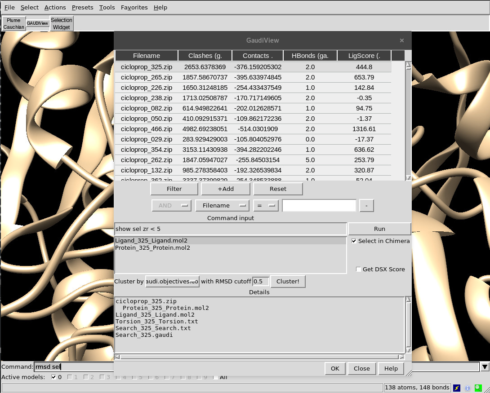

.. GaudiMM: Genetic Algorithms with Unrestricted
   Descriptors for Intuitive Molecular Modeling
   
   https://github.com/insilichem/gaudi
  
   Copyright 2017 Jaime Rodriguez-Guerra, Jean-Didier Marechal
   
   Licensed under the Apache License, Version 2.0 (the "License");
   you may not use this file except in compliance with the License.
   You may obtain a copy of the License at
   
        http://www.apache.org/licenses/LICENSE-2.0
   
   Unless required by applicable law or agreed to in writing, software
   distributed under the License is distributed on an "AS IS" BASIS,
   WITHOUT WARRANTIES OR CONDITIONS OF ANY KIND, either express or implied.
   See the License for the specific language governing permissions and
   limitations under the License.

.. _tutorial-visualization:

========================================
Tutorial: Visualizing your first results
========================================

When a GaudiMM job finishes correctly, you will find the results in the directory specified at ``output.path``. There you will find:

- ``*.gaudi-input``. An (updated) copy of the input file used in this job, for reproducibility purposes.
- ``*.gaudi-log``. A detailed log of the simulation, for debugging purposes.
- ``*.gaudi-output``. A YAML file with the scores and paths of the solutions.
- (Potentially lots of) ``*.zip``. As many as the elite population size. Each zip contains an Individual, which means that you will find molecule files (normally, mol2 files), as well as the allele metadata of the rest of the genes.
  
To analyze the results, currently the best tool is our own extension for UCSF Chimera, `GaudiView <https://github.com/insilichem/gaudiview>`_. After `installing it <https://github.com/insilichem/gaudiview/blob/master/README.md#installation>`_, you can type the following:

.. code-block:: console

    gaudi view *.gaudi-output

, and hopefully it will open Chimera and GaudiView to load the output file. If it doesn't work (please, if that's the case, report it in the issues page!), you can always UCSF Chimera, fire up GaudiView from ``Tools> InsiliChem> GAUDIView`` and browse the file manually.

One way or another, you will end up seeing the following dialog:

Actions
=======

The following actions are available:

- **Depiction**

    + ``Click`` on a row to show that solution *as is*. ``Double-click`` may trigger additional post-processing as detailes in the genes metadata, depending on the chosen genes.
    + ``Ctrl-click`` or ``Shift-click`` to select more than one solution at the same time.
    + Use ``up`` and ``down`` arrows to move along the list.

- **Sorting**

    + Click on the column headers to sort by that key.

- **Filtering**

    + Press ``+Add`` to load a new filter. Select the filter key, specify the cutoff and press ``Filter``. Repeat to add more filters with the selected boolean.
    + Remove filters by pressing on -.
    + Clear all the filters with ``Reset``.

- **Commands**

    + Every time you change the selected row, the command specified in the *command input* panel will be run. You can force it by pressing ``Enter`` key or click on ``Run``.
    + Combine the command line with the dynamic selection panel to run commands like ``show sel zr < 5`` to depict the surrounding residues of docking poses.
    + Multiple commands can be chained with ``;``.

- **Clustering**

    + First, choose the column to use as *energy* criteria.
    + Select the RMSD cutoff. If two solutions have RMSD bigger than this value, they won't be considered similar and thus not clustered together.
    + Press ``Cluster!``. Since this method requires to load all solutions at once, it can take some time if you have a lot of solutions.
    + When it's done, a new column ``Cluster`` will be available at the end of the table. Sort by that column to group them together and ``Shift-click`` to depict the full cluster.

When you are done with the analysis, you can exit GaudiView in different ways:

- **Click** ``OK``. The depicted solutions at that moment won't be closed, and thus available for further post-processing in Chimera. Every other solution previously loaded will be removed from the canvas and closed.
- **Click** ``Close`` **or upper-corner** ``X``. All solutions, visible or not, will be removed from canvas and closed.

.. error::
  
    There's a known bug in GaudiView that may trigger a non-critical exception if you filter the solutions and then try to sort them again without selecting a new row beforehand. You can dismiss the dialog and simply click in any row to avoid this bug. It will be fixed soon, promise!